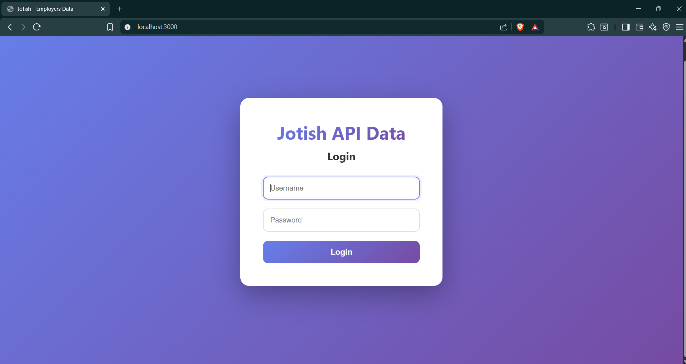
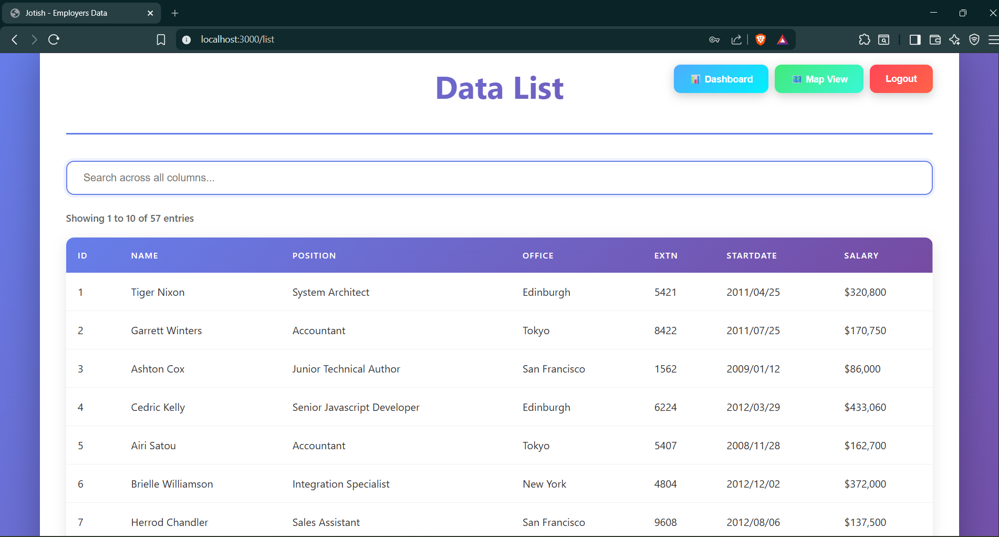
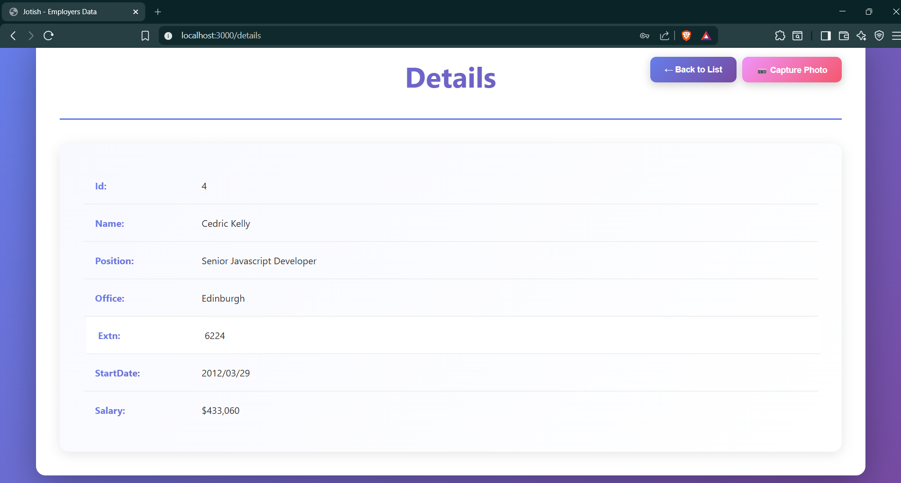
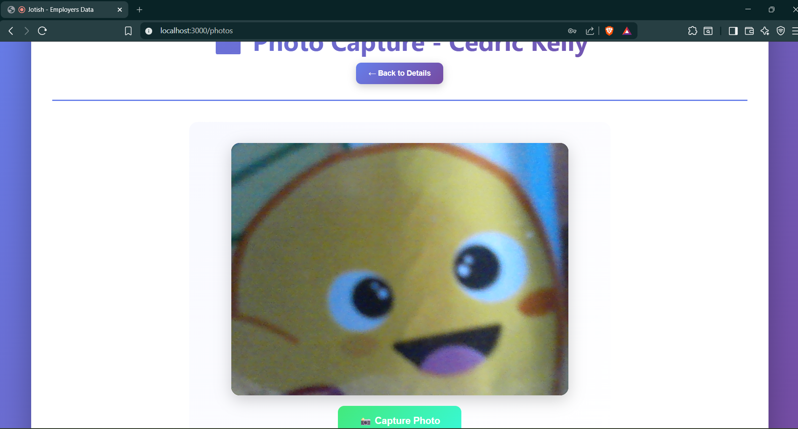
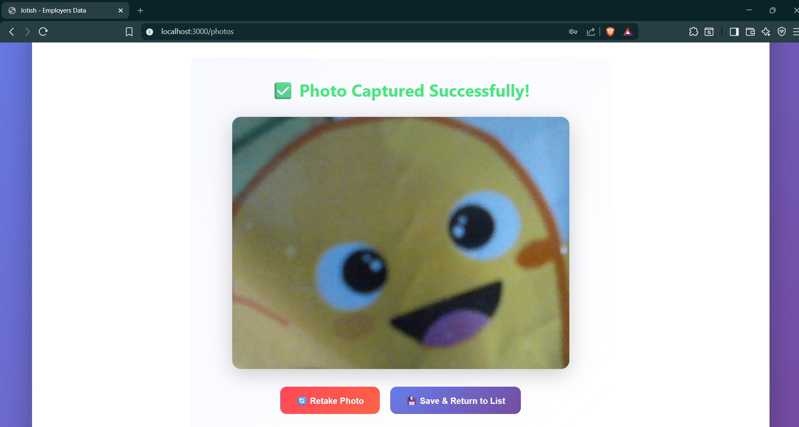
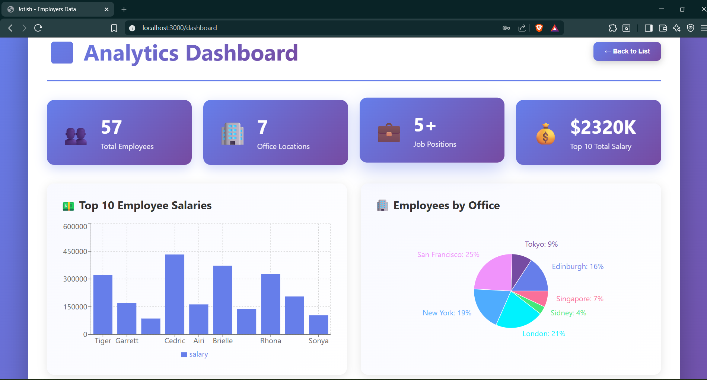
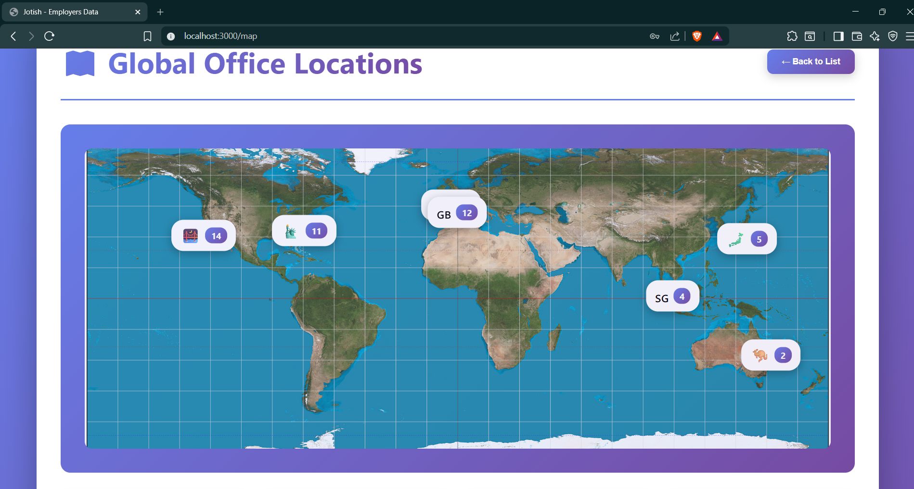

# API Listing Of Employers Of Jotish

A fully functional ReactJS application with 6 pages including Login, List, Details, Photo Capture, Dashboard (with charts), and Map View.

## Technology Stack
- React 18.2.0
- React Router DOM
- Recharts (for data visualization)
- Webpack 5
- Babel 7
- Pure CSS3

## Installation & Setup

### Prerequisites
- Node.js (v14 or higher)
- npm (v6 or higher)

### Steps to Run
```bash
# Navigate to project directory
cd jotish-react-app

# Install dependencies
npm install

# Start development server
npm start
```

The application will open at `http://localhost:3000`

## Login Credentials
- **Username**: `testuser`
- **Password**: `Test123`

## API Details
- **Endpoint**: `https://backend.jotish.in/backend_dev/gettabledata.php`
- **Method**: POST
- **Body**: 
```json
{
  "username": "test",
  "password": "123456"
}
```

## Features Implemented

### Required Features (As per documentation)
1. ✅ **Login Page** - Username/password authentication
2. ✅ **List Page** - Displays data from REST API with search and pagination
3. ✅ **Details Page** - Shows detailed information of selected item
4. ✅ **Photo Capture Page** - Camera integration to capture photos

### Bonus Features (Creativity)
5. ✅ **Dashboard Page** - Data visualization with:
   - Statistics cards
   - Bar chart (Top 10 salaries)
   - Pie chart (Office distribution)
   - Line chart (Job positions)
6. ✅ **Map View Page** - Geographic visualization of office locations

### Additional Features
- Real-time search across all columns
- Smart pagination with ellipsis
- City-based filtering from map
- Responsive design (mobile, tablet, desktop)
- Smooth animations and transitions
- Professional gradient UI
- Error handling and loading states

## Application Flow

### Main Flow (Required)
1. **Login** → Enter credentials → Click Login
2. **List** → View employee data → Click any row
3. **Details** → View employee details → Click "📷 Capture Photo"
4. **Photos** → Click "Start Camera" → Click "📸 Capture Photo" → View captured image

### Bonus Flow
- **List** → Click "📊 Dashboard" → View charts and analytics
- **List** → Click "🗺️ Map View" → View office locations → Click city → Filter list

## Project Structure
```
jotish-react-app/
├── src/
│   ├── components/
│   │   ├── Login.js          # Login page
│   │   ├── List.js           # Data list with search & pagination
│   │   ├── Details.js        # Detail view
│   │   ├── Photos.js         # Camera capture
│   │   ├── Dashboard.js      # Charts & analytics
│   │   ├── MapView.js        # Map visualization
│   │   ├── SearchBar.js      # Search component
│   │   └── Pagination.js     # Pagination component
│   ├── styles/
│   │   └── App.css           # All styling
│   ├── App.js                # Main app with routing
│   └── index.js              # Entry point
├── public/
│   └── index.html            # HTML template
├── package.json              # Dependencies
├── webpack.config.js         # Build configuration
└── .babelrc                  # Babel configuration
```

## Screenshots

### 1. Login Page

- Clean login interface
- Username: testuser, Password: Test123

### 2. List Page

- Employee data table
- Search functionality
- Pagination controls
- Dashboard and Map buttons

### 3. Details Page

- Detailed employee information
- Capture Photo button

### 4. Photo Capture Page

- Camera preview
- Capture button

### 5. Photo Result

- Captured image display
- Retake and Save options

### 6. Dashboard Page

- Statistics cards
- Bar chart (Salaries)
- Pie chart (Offices)
- Line chart (Positions)

### 7. Map View Page

- World map with office markers
- City cards with employee counts

## Video Demonstration
📹 **Screen Recording**: 


The video demonstrates:
- Login process
- Browsing employee list
- Viewing employee details
- Capturing photo with camera
- Dashboard analytics
- Map view navigation
- Search and filter functionality
- Responsive design

## Key Highlights

### Code Quality
- Clean, readable code
- Proper component structure
- Reusable components
- Error handling
- Loading states

### UI/UX
- Modern gradient design
- Smooth animations
- Intuitive navigation
- Professional appearance
- Responsive layout

### Functionality
- All required features implemented
- Bonus features added
- Real API integration
- Camera integration
- Data visualization

## Browser Compatibility
- ✅ Chrome (Recommended)
- ✅ Edge
- ✅ Firefox
- ✅ Safari

## Notes
- Camera feature requires HTTPS or localhost
- Browser must allow camera permissions
- All features tested and working

## Submission Contents
1. ✅ Fully functional source code
2. ✅ Screenshots folder with all screens
3. ✅ Screen recording video
4. ✅ This README file

---

**Developed for Jotish Frontend Developer Internship Assignment**
